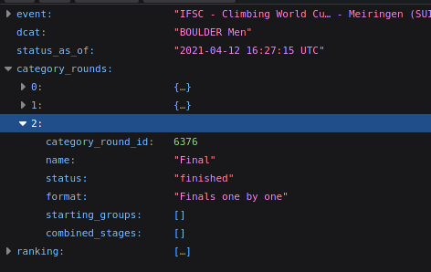

# IFSC Climbing Results
Displaying IFSC Climbing results with nodejs inside a console


## How to

```bash
git clone https://github.com/m1ga/ifsc_results
cd ifsc_results
npm i
node index.js
```

The screen will refresh every minute with new results.

## Change event

To get the event ID you currently have to go to:<br/>
https://www.ifsc-climbing.org/index.php/world-competition/calendar<br/>
get the `event_id` (e.g. `1187`) and open this URL with your event id:<br/>
https://components.ifsc-climbing.org/results-api.php?api=overall_r_result_complete&event_id=1187&category_id=3<br/>
_(change `1187` to your event ID)_

From there you grab the ID from `categry_rounds` you would like to follow:
<br/>
_here it is `6376`_

Put that number into line 1 in `index.js`.

## TODO
* extend the script so you can select the event and category without using the page!
* auto-select current event
* better UI
