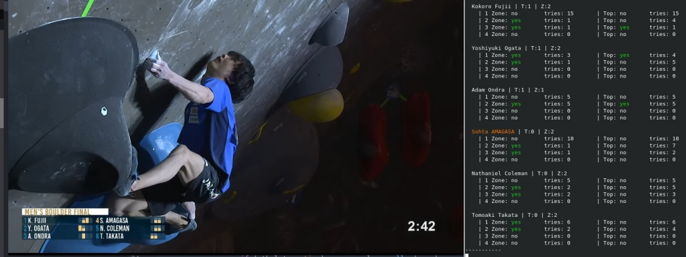
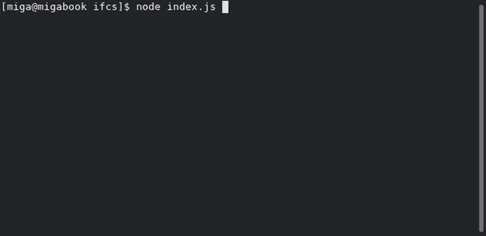

# IFSC Climbing Results

Displaying IFSC Climbing results with nodejs inside a console


## How to

```bash
git clone https://github.com/m1ga/ifsc_results
cd ifsc_results
npm i
node index.js
```



### Parameter

If you know the ID of the event and round already you can start it with

```bash
node index.js 0 38
```

This will select `World Cups and World Championships (0)` and `IFSC - Climbing World Cup (L,S) - Villars (SUI) 2021 -LEAD Women | Semi-Final (38)` and will display the scores right away.

The screen will refresh every minute with new results.

## TODO

-   auto-select current event
-   better UI
